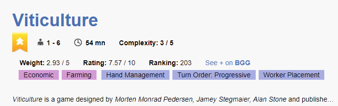

  
  <h1>Improved BGA Game Information</h1>
   
    <a href="https://addons.mozilla.org/en-US/firefox/addon/improved-bga-game-info/" target="_blank">

  

 

**Improved BGA game info** is a browser extension that will display more information about a given game on [Board Game Arena](https://boardgamearena.com). This includes the weigth, rating, ranking and also the the category and mechanisms of the game.
You'll also have a link to quickly look into the game in [Board Game Geek](https://boardgamegeek.com).

    
     
     

The extension will include the extended information when in page for games, that is, pages starting with `https://boardgamearena.com/gamepanel`.

**Tip**: It works best if you set BGA language to English.

## Installation

[Google Chrome](https://chrome.google.com/webstore/detail/improved-bga-game-info/hihdoablflnlippakmimnjacpcfpbdni?hl=pt-BR&authuser=1) | [Microsoft Edge](https://microsoftedge.microsoft.com/addons/detail/lkenagolgpfonfmdglbhgnfhanahnbkh) | [Mozilla Firefox](https://addons.mozilla.org/en-US/firefox/addon/improved-bga-game-info/) 
 
For instalation on other Browsers (Opera, Vivaldi, etc), use the [Chrome web store](https://chrome.google.com/webstore/detail/improved-bga-game-info/hihdoablflnlippakmimnjacpcfpbdni?hl=pt-BR).

## Development

1. Clone the repository

### On Google Chrome
1. Go to `chrome://extensions`
2. Enable Developer Mode in the right top corner if it's not enabled already
3. Click `Load unpacked` and select the `extension/` directory in the cloned repository folder
4. When developing, after making and saving changes, click refresh on the extension

### On Microsoft Edge
1. Go to `edge://extensions`
2. Enable Developer Mode in the left column if it's not enabled already
3. Click `Load unpacked` and select the `extension/` directory in the cloned repository folder
4. When developing, after making and saving changes, click refresh on the extension

### Mozilla Firefox
1. Go to `about:addons`
2. Click on the gear icon and select `Debug Add-ons`
3. Click on `Load Temporary Add-on`
4. Select the `extension/background.js` file from the cloned repository
5. When developing, after making and saving changes, click refresh on the extension

## Suggestions and feedbacks
Feedbacks are more than welcome! Feel free to fill an [issue](https://github.com/thamara/improved-bga-game-info-extension/issues/new) suggesting new fields to be shown, reporting bugs, or any other feedback.

## Known issues
This extension is considered **work in progress**, so a few issues are know:
- **Language related issues:** Some games have their names translated in BGA, but BGG API is English based which causes some games to not have the information shown. Example: Using the Portuguese language, the game [6 nimmt!](https://boardgamearena.com/gamepanel?game=sechsnimmt) is translated as "Pega em 6", which is not found on BGG. 

## Credits
All the game information is based [BGG XML API](https://boardgamegeek.com/wiki/page/BGG_XML_API2). The code for parsing the API return is based on [roderickwoodman/boardgameinator](https://github.com/roderickwoodman/boardgameinator).
